#**This is a school project**
# English Quiz & Management Application

A cross-platform mobile application for English learning, featuring interactive quizzes and a comprehensive Admin Panel.

## 📸 Project Showcase

  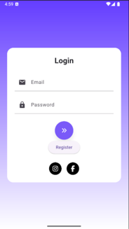
  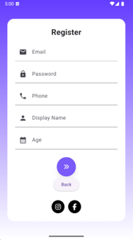
  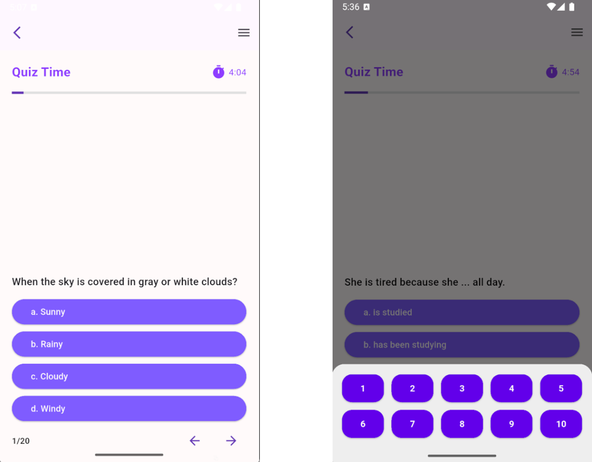
  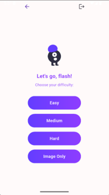
  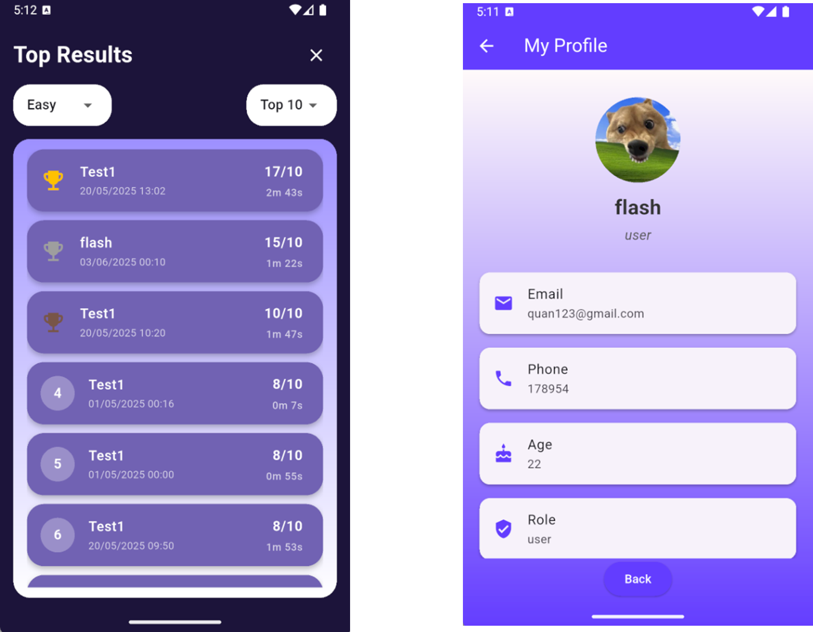
  
  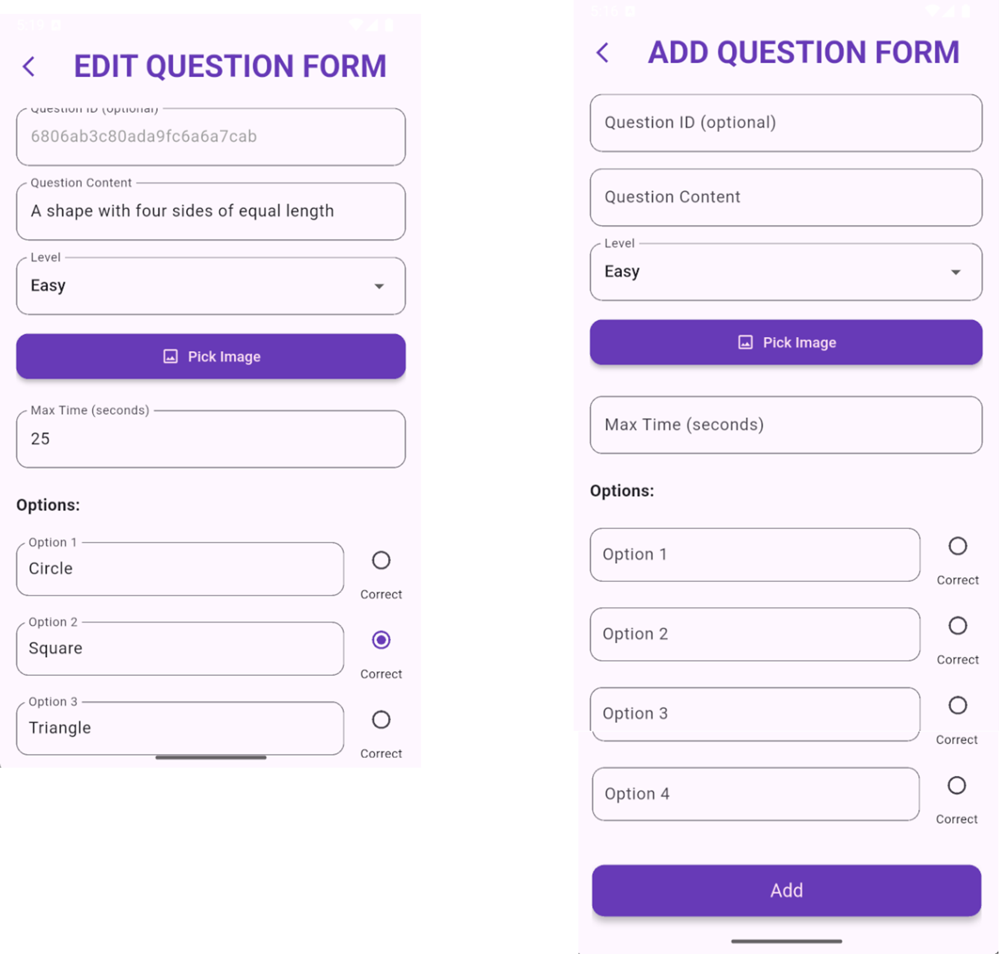
  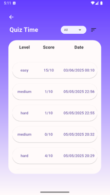
  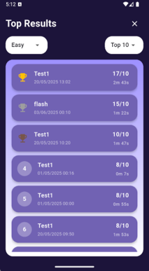
  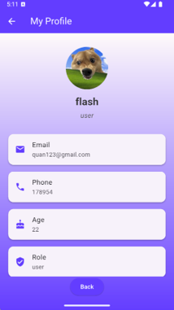
  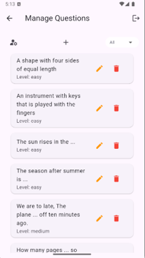
  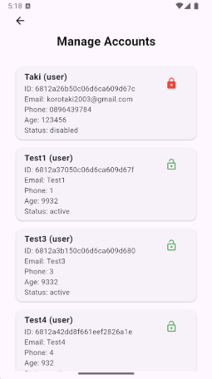
  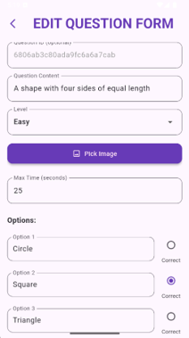
  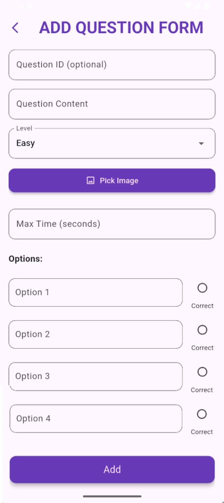

## 🚀 Key Features
- **Quiz Flow:** Real-time quiz sessions with score tracking and leaderboard.
- **Answer Review:** Detailed post-submission review showing correct vs. incorrect choices.
- **Admin Dashboard:** Full CRUD operations for managing questions, filtering by difficulty, and user management.
- **Security:** Built-in account enable/disable functionality for administrators.

## 🛠 Tech Stack
- **Framework:** Flutter (Dart)
- **UI Design:** Figma
- **Backend/DB:** MongoDB, Firebase

## ⚠️ Project Status
**Note:** The backend services for this project are currently offline. The screenshots provided above illustrate the application's UI/UX and core functionalities.
